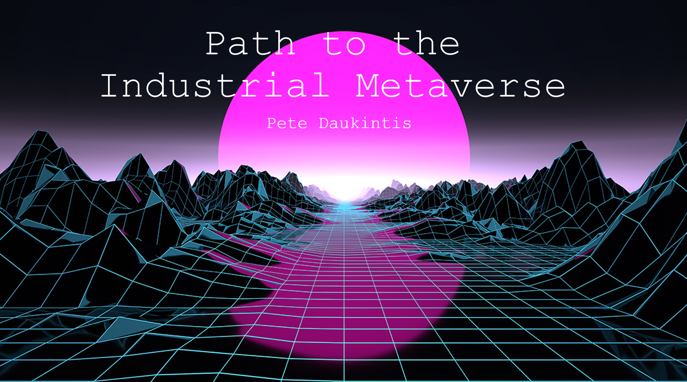
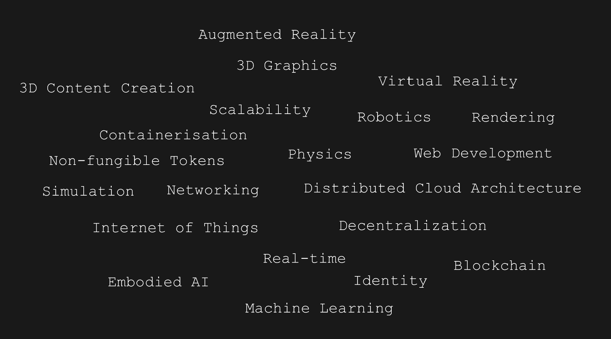
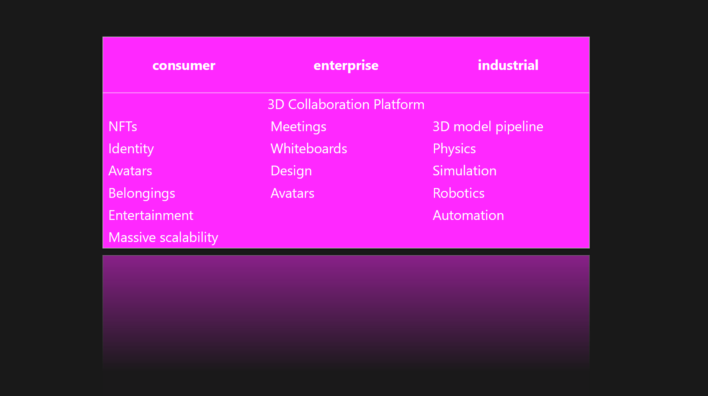
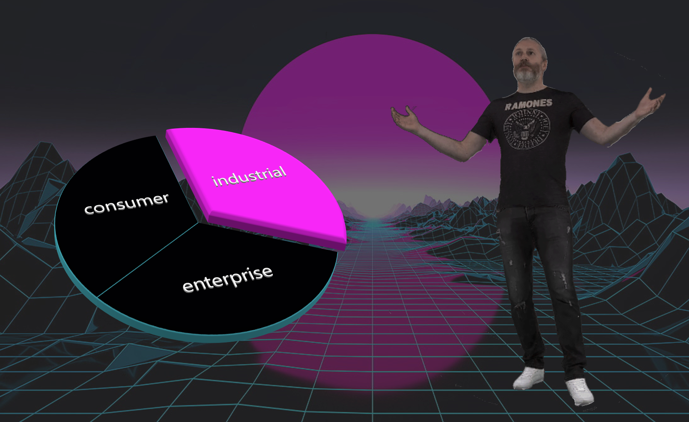
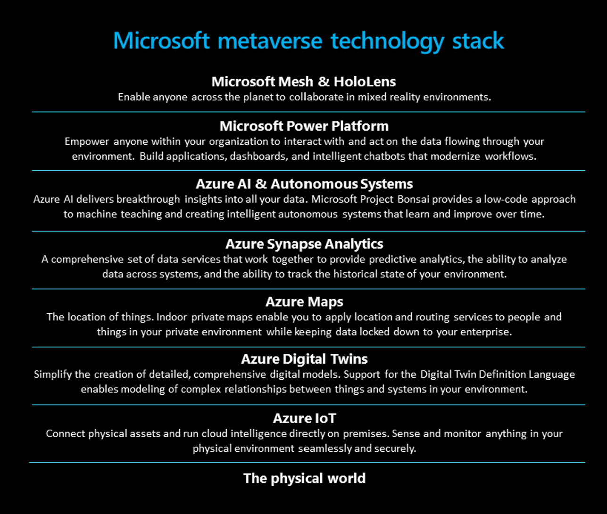
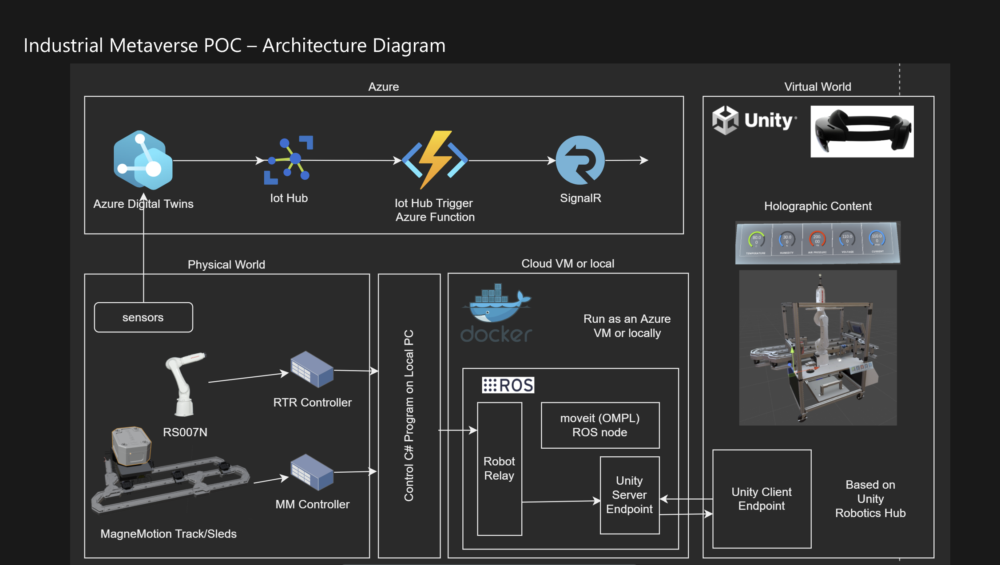
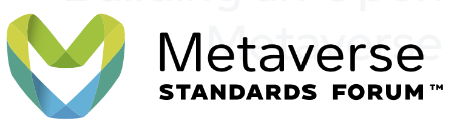

# Path to the Industrial Metaverse

I recently gave a talk at the London Tech Summit 2022 on metaverse technology and more specifically, the Industrial Metaverse. It has been a while since I have given any talks at all, largely due to job changes at Microsoft and the pandemic and prior to that was giving talks largely on Mixed Reality at Microsoft. So, in the meantime, both the real world and its digital twin have moved on and 'metaverse' has become the vastly overused tech buzzword du jour. Weird for those thinking about it alongside VRML back in the mid-nineties. Check this [New Scientist article](https://people.well.com/user/bbear/vrml.html) out. 

This is obviously happening for real this time though and with a renewed vigour given the dovetailed rise of the significant tech elements involved. Now, I do hear talk around the metaverse as a whole and it's nature as the next evolution of the internet and that conversation now envelops pretty much everything given that the internet as it stands now is a pretty sizable topic. Add to that how existing tech needs to change to accommodate, bundle up 3D and spatial forms of computing, new advances in AI, rendering technology and then include all of the new use cases this might uncover and consider who and in what context these new use cases might be needed and you are soon overwhelmed with information. 

I noted down a few high-level tech areas that popped into my head whilst thinking about my talk. If we go any deeper into products, programming languages and development and creative tools and then the further nitty-gritty of the implementation details then we’ll soon be lost in all of this.

> Imagine the associated job adverts with their usual laundry list of unobtainable yet required, skills and experience... 

Satya Nadella mentioned in one of his recent keynotes the breakdown of 'the metaverse' into consumer, enterprise and industrial categories. I have tended to lump consumer and enterprise together a little bit but it is clear to me that the conversation and foundations for an industrial metaverse are different. I fully expect these to converge later down the line at least at the core platform level. 

The common layer shared between these categories is a 3D, spatial collaboration platform. This is essentially a massively multiplayer online networked game which allows meetings and collaborative design but fundamentally provides 'presence'. The closer this gets to 'in real life' physical human interaction the better. This, for me is the bedrock and a necessary component to be built into the ower levels of any ensuing platform. For me the content would be consumed immersively using AR/VR or on a 2D screen but vitally must use 3D rendering. Others take a different view here but I usually look at things from a client 3D rendering perspective given my background working with HoloLens and 3D graphics. 

My thesis is that there exist real, high return on investment use cases in manufacturing that represent low-hanging fruit and can be/and is being implemented right now using the tech stacks available. Realising those will necessitate the building of vital infrastructure for the industrial metaverse and inform the requirements. A bit like the software practice of taking a slice through the architecture.

So we’re going to divide and (hopefully) conquer…

I worked on a project with Kawasaki Heavy Industries which was featured in Satya's Build 2022 Keynote. I built the HoloLens app and the Azure Digital Twins pipeline for this and did a fair bit of thinking about the next steps.

Let me paint a picture of a notional but believable, use case. 

> We are concerned with a production line where robots are being used to manipulate a product travelling along a conveyor belt. 

> Cameras running computer vision algorithms on the edge are monitoring the products. 

> Some of the products are not being placed correctly by the robot and this is detected by the cameras. 

> Something changed maybe; the weight of the product increased or the gripper on the robot arm is not functioning correctly. 

> Either way, notifications are sent out to the team involved. 

> The team can meet in the metaverse and using sensor and other telemetry data along with the super-power to simulate the production line using high-fidelity physics and 3D rendering and they can brainstorm a solution. 

> If necessary a HoloLens or mobile phone could direct a front-line worker to the production line site (some of these plants can be massive!). 

> A front-line worker can run a resulting physics simultation and view a holographic robot arm to ensure that the proposed solution runs correctly in-situ. Once all are agreed any fixes and new code can be pushed remotely to the real production line.

In summary, that simple scenario or a myriad of variations on this can help maximise the running time of the production lines.

## The Microsoft Metaverse Stack

Alongside traditional enterprise offerings such as Identity and Auth Systems, and distributed cloud architecture core services such as blob and data storage facilities, processing and GPU services Microsoft provides a suite of services directly applicable to the Industrial Metaverse. 

> Azure AI & Autonomous Systems – Project Bonsai – Deep Reinforcement Learning and simulation. Can be used to train robots to carry out tasks

> Azure Digital Twins (ADT) – Topological graph data structure of environment, e.g. factory -> rooms -> production line -> robot

The challenge here is how to thread all of these pieces together into a cohesive, repeatable and scalable solution. There are quite a few missing pieces here too; thinking about scalable 3D rendering, scalable physics processing and robotics at scale.

> Not mentioned here are some of the Mixed Reality services, such as [Azure Remote Rendering](https://azure.microsoft.com/en-gb/products/remote-rendering/) and [Azure Spatial Anchors](https://azure.microsoft.com/en-ca/products/spatial-anchors/) which also plug some of the gaps. Again these often start from the position of you already having suitable 3d models. 

The larger missing piece here is an interopable 3D scene in the cloud.

## Proof of Concept

There is so much value in building something tangible; not least the pain points experienced and from that a desire to avoid those in future. Also, despite the hackery sometimes invoked to cobble together a POC it really informs about how a real system would be built and provides a test bed to experiment on ideas further.

The HoloLens POC shown at Build consists of a digital twin of a real Kawasaki robot arm and associated hardware. A hologram of the hardware could be aligned with the physical hardware using QR codes to align coordinate systems and the robot movement could be programmed via the cloud. The robot arm digital twin exhibits physical properties and so could be driven by a physical simulation or could just mirror the physical hardware. 

This meant that the use case described above could be supported but also the HoloLens app could be used to show a demo sans hardware and just eplaying data captured from the hardware previously. It is important to remember here that this is just a hack to show the art of the possible.

For context, here's a video of the HoloLens app which shows a demo of the holograms and also control of them via ROS ([Robotics Operating System](https://www.ros.org/)) which is deployed via a Docker container hosted on Azure.

### POC Learning

- No reusable collaboration platform as [Microsoft Mesh](https://www.microsoft.com/en-us/mesh) was not ready for us to use. 

> (The app can be considered to be a shared experience since coordinate systems from two HoloLens devices can be synchronised using QR code aligment and the data is delivered to multiple clients in real-time)

- Highlights the traditional interop problems in the industry (no one standard file format)

> There are a litany of 3d file formats, obj, fbx, collada, tools use different coordinate systems and units, material definitions… Hand optimisation for the target client device and the developer/designer process is time-consuming and difficult

- The 3D models are compiled statically into the HoloLens application and were hand optimised to run on a mobile GPU

> This is clearly not easily repeatable for different scenarios.

- No central 3D data repository

> The 3D data is used ad-hoc and baked into the app

- Not location aware
- Not scalable to multiple robots

### Conclusions

Having a central store of 3D data can alleviate some of these issues.

Location: client apps should know their location and query the Digital Twins model to work out what to show the user.

Scalability needs to be solved for rendering, simulation processing and networking.

## Metaverse Standards Forum

[The Khronos Group](https://www.khronos.org/) have huge amounts of experience defining technology standards (e.g. glTF, OpenGL, WebGL, etc.) have set up the MSF with support from many companies including Autodesk, Epic, Microsoft, Google, Magic Leap, Meta
Some notable exceptions: Apple, Roblox and Niantic, and crypto-based metaverse platforms like The Sandbox and Decentraland, are also absent (for now...).

## USD

USD (universal scene description) is being pitched as the HTML of the metaverse. Has a notable pedigree, having been developed to support collaboration and workflows by Pixar for usage in feature film development. Was open sourced in 2016 making it open, highly collaborative and extensible.

## Omniverse

Nvidia have taken USD further and developing additions to support real-time and physics amongst other areas.
Omniverse’s Nucleus server provides a central repository for 3D data based on USD which has a suite of connectors to content creation programs such as Unreal Engine, Blender and Maya amongst others. This provides interopability and real-time updates and collaboration which solves many of the issues previously mentioned. 

In fact, I think NVidia are addressing interoperability, collaboration and scalability. Omniverse deserves much more than a cursory glance and in addition NVidia seems to be taking a somewhat open approach. They have a composable app model with Omniverse kit from which they have built applications such as Create which is a feature-full, real-time 3D content creation application for authoring 3D scenes, described with USD in their Nucleus server offering. Nucleus allows distributed hosting via the LAN or cloud. I just experienced real-time ray tracing in VR using their Create XR offering which is pretty wild. 

